# 🎙️ Real-Time German Audio Transcription Showdown

Ever wondered what would happen if you put 3 different speech-to-text AI models in a cage match? No? Well, I did it anyway, and it's pretty awesome!

This project streams German audio through **3 concurrent transcription servers** and displays the results in real-time. It's like watching a rap battle, but with AI models trying to understand German health advice about vegetables. 🥦

> ℹ️ **Disclaimer:** This is a weekend project enhanced with AI tools like [Claude Code](https://claude.com/claude-code). The code quality reflects rapid prototyping and experimentation. Use at your own risk, and expect some rough edges! 🛠️

## 🎯 What Does This Thing Do?

Imagine you're listening to German audio, and you want to see what's being said... but you're indecisive and can't pick just ONE transcription service. This project says "Why choose?" and transcribes your audio through:

1. **Voxtral Mini** (Mistral Cloud API) - The speedster. Runs in the cloud at 24x real-time speed. It's basically The Flash of transcription.
2. **Parakeet TDT v3** (NVIDIA) - The GPU enthusiast. Runs on your graphics card at 8.5x speed. Your gaming rig is now a transcription powerhouse!
3. **Faster-Whisper** (CPU with spaCy) - The sentence perfectionist. Uses spaCy to detect German sentence boundaries at 3x speed.

All three models transcribe the same audio **simultaneously**, and you can watch them race to see who finishes first (spoiler: Voxtral usually wins, but Parakeet puts up a good fight).

## 🚀 Real-World Use Cases

Beyond just comparing models, this architecture enables some genuinely useful applications:

### 🎯 Production Use Cases

- **Live video subtitling with FFmpeg**: Stream SRT subtitles from video files or RTSP streams
  ```bash
  ffmpeg -i input.mp4 -f s16le -ar 16000 -ac 1 - | \
    # Pipe to WebSocket for real-time transcription
  ```
- **WebRTC conference transcription**: Integrate with video conferencing systems (Janus Gateway, Jitsi, BigBlueButton, etc.) for live meeting transcription and accessibility
- **Podcast/YouTube processing**: Bulk transcribe German audio content for SEO, accessibility, or translation workflows
- **Accessibility services**: Real-time captioning for German live streams, broadcasts, or events
- **Language learning tools**: Compare native speaker audio with real-time transcription to improve pronunciation
- **Customer service QA**: Transcribe German customer calls for quality assurance and training

### 🔬 Research & Development

- **Model comparison**: Benchmark accuracy across different German dialects and accents
- **Speed benchmarking**: Measure real-world latency for production deployment decisions
- **Academic research**: Study ASR (Automatic Speech Recognition) model behavior and accuracy
- **A/B testing**: Compare transcription quality before committing to expensive API services
- **Trust & reliability**: Cross-validate critical transcriptions with multiple models for high-stakes applications

### 🛠️ Developer Use Cases

- **API development**: Use the WebSocket servers as backend for mobile apps, Electron apps, or web services
- **Integration testing**: Test your application against multiple STT providers simultaneously
- **Prototype rapid**: Quickly build proof-of-concept transcription features without vendor lock-in
- **Cost optimization**: Compare cloud (Voxtral) vs. self-hosted (Whisper/Parakeet) costs at scale

## 🏗️ Architecture Overview

> 💡 **Note:** All diagrams are available as PNG files in the [`assets/`](assets/) folder for use in presentations or external documentation.

### System Architecture


### Data Flow


### Docker Deployment Architecture


## 🎬 The Demo

The project includes two web interfaces:

### 1. **Real-Time Streaming Mode** (`realtime-transcription-streaming.html`)
Watch transcriptions appear word-by-word as the audio plays. It's like watching subtitles being written in real-time by three different people. The suspense! The drama! The occasional spelling mistakes!

### 2. **Comparison Mode** (`realtime-transcription.html`)
Press a button, wait a few seconds, and BAM! All three complete transcriptions side-by-side. Great for comparing accuracy (and finding out which model thinks "Ernährung" sounds like "Entenbraten").

## 👤 User Flow

### Real-Time Streaming Mode Flow

```mermaid
flowchart TD
    Start([User Opens App]) --> LoadPage[Load realtime-transcription-streaming.html]
    LoadPage --> Connect{Connect to<br/>3 Servers}

    Connect -->|WebSocket| Server1[Voxtral :5000]
    Connect -->|WebSocket| Server2[Whisper :5001]
    Connect -->|WebSocket| Server3[Parakeet :5002]

    Server1 --> Check1{Connected?}
    Server2 --> Check2{Connected?}
    Server3 --> Check3{Connected?}

    Check1 -->|Yes| Status1[✓ Voxtral: Connected]
    Check1 -->|No| Error1[✗ Voxtral: Disconnected]
    Check2 -->|Yes| Status2[✓ Whisper: Connected]
    Check2 -->|No| Error2[✗ Whisper: Disconnected]
    Check3 -->|Yes| Status3[✓ Parakeet: Connected]
    Check3 -->|No| Error3[✗ Parakeet: Disconnected]

    Status1 & Status2 & Status3 --> AllReady[All Servers Ready]
    AllReady --> SelectAudio[User Selects Audio File]

    SelectAudio --> Play[User Presses Play]
    Play --> Stream{Audio Streaming}

    Stream --> Chunk[3.5s Audio Chunk]
    Chunk --> Process[Convert to 16kHz PCM]
    Process --> SendAll[Send to All 3 Servers]

    SendAll --> Wait[Wait for Responses]

    Wait --> R1[Voxtral Response<br/>~1.5s]
    Wait --> R2[Whisper Response<br/>~4s]
    Wait --> R3[Parakeet Response<br/>~12s]

    R1 --> Display1[Update Voxtral Column]
    R2 --> Display2[Update Whisper Column]
    R3 --> Display3[Update Parakeet Column]

    Display1 & Display2 & Display3 --> Continue{More Audio?}

    Continue -->|Yes| Chunk
    Continue -->|No| Complete[Transcription Complete]

    Complete --> Compare[User Compares Results]
    Compare --> End([End])

    Error1 & Error2 & Error3 --> Retry[Retry Connection<br/>or Check Server Status]

    style Start fill:#4a9eff,stroke:#1e3a8a,stroke-width:3px,color:#fff
    style AllReady fill:#34d399,stroke:#065f46,stroke-width:3px,color:#000
    style Complete fill:#fbbf24,stroke:#92400e,stroke-width:3px,color:#000
    style Compare fill:#a78bfa,stroke:#5b21b6,stroke-width:3px,color:#fff
    style End fill:#4a9eff,stroke:#1e3a8a,stroke-width:3px,color:#fff
```



### Comparison Mode Flow


### Integration Workflow (FFmpeg/WebRTC)


## 🛠️ Prerequisites

Before you embark on this journey, you'll need:

### Software Requirements

- **Python 3.10+** - Because we're not savages
- **FFmpeg** - The Swiss Army knife of media processing
- **CUDA** (optional) - If you have an NVIDIA GPU and want Parakeet to go brrrr

### Hardware Requirements

- **RAM**: At least 16GB (those models are chonky)
- **GPU** (recommended): NVIDIA with 4GB+ VRAM for Parakeet
- **Disk space**: ~10GB for all the models
- **Patience**: Especially during first-time model downloads

### API Keys

- **Mistral API key** - For Voxtral (get one at [console.mistral.ai](https://console.mistral.ai))
  - Cost: ~$0.001 per minute of audio (cheaper than your daily coffee)
- **HuggingFace token** (optional but recommended) - For downloading models
  - Get one at [huggingface.co/settings/tokens](https://huggingface.co/settings/tokens)
  - Required if models are gated or for faster downloads
  - Set via: `export HF_TOKEN=your_token_here` or in Docker Compose

## 📦 Installation

Let's get this party started! Open your terminal and channel your inner hacker:

### 1. Install System Dependencies

**Ubuntu/Debian:**
```bash
sudo apt update
sudo apt install python3-pip ffmpeg portaudio19-dev python3-pyaudio
```

**macOS:**
```bash
brew install python3 ffmpeg portaudio
```

**Windows:**
Download FFmpeg from [ffmpeg.org](https://ffmpeg.org/) and add it to your PATH. Or switch to Linux (just kidding... mostly).

### 2. Install Python Dependencies

```bash
pip install websockets numpy soundfile scipy nemo_toolkit torch faster-whisper mistralai spacy
```

Then download the German spaCy model:
```bash
python -m spacy download de_core_news_sm
```

### 3. Set Up Your Mistral API Key

Create a `.env` file or set an environment variable:

```bash
export MISTRAL_API_KEY="your_api_key_here"
```

Or hardcode it in `voxtral-api-server.py` (but don't commit it to GitHub unless you want your key to become public property).

## 🐳 Running with Docker

All services are accessible through **port 80** via Nginx reverse proxy. This is production-ready and works with standard HTTP/HTTPS ports.

### Architecture
```
Port 80 (Nginx) → Routes to:
  /                    → Web UI
  /api/voxtral/        → Voxtral WebSocket
  /api/whisper/        → Faster-Whisper WebSocket
  /api/parakeet/       → Parakeet WebSocket
```

### Option 1: CPU-Only (Voxtral + Web UI)
Perfect for testing or if you don't have an NVIDIA GPU:

```bash
docker compose -f docker-compose.cpu.yml up -d
```

This starts:
- Nginx reverse proxy (port 80)
- Voxtral server (internal port 5000) - Uses Mistral Cloud API
- Web UI (internal port 8000)

**Access the application:** `http://localhost/`

### Option 2: Full Stack with GPU
Requires NVIDIA GPU and Docker GPU support:

#### Install NVIDIA Container Toolkit first:
```bash
# Ubuntu/Debian
distribution=$(. /etc/os-release;echo $ID$VERSION_ID)
curl -s -L https://nvidia.github.io/nvidia-docker/gpgkey | sudo apt-key add -
curl -s -L https://nvidia.github.io/nvidia-docker/$distribution/nvidia-docker.list | sudo tee /etc/apt/sources.list.d/nvidia-docker.list

sudo apt-get update
sudo apt-get install -y nvidia-container-toolkit
sudo systemctl restart docker
```

Then set up your API keys and start all services:
```bash
# Set environment variables
export MISTRAL_API_KEY="your_mistral_key_here"
export HF_TOKEN="your_huggingface_token_here"  # Optional but recommended

# Start all services
docker compose up -d
```

This starts:
- Nginx reverse proxy (port 80)
- Voxtral server (internal port 5000)
- Whisper GPU server (internal port 5001)
- Parakeet GPU server (internal port 5002)
- Web UI (internal port 8000)

**Access the application:** `http://localhost/`

**Note:** On first run, Whisper and Parakeet will download their models from HuggingFace (~3GB total). This may take 5-10 minutes depending on your connection.

### Production Deployment

For production servers with only ports 80/443 open:

1. **HTTP (port 80):** Already configured! Just run `docker compose up -d`

2. **HTTPS (port 443):** Add SSL/TLS certificates to Nginx:
   ```bash
   # Update nginx.conf to listen on 443
   # Add SSL certificate paths
   # Redirect HTTP to HTTPS
   ```

3. **Custom Domain:** Update your DNS A record to point to your server IP

The WebSocket URLs automatically adapt based on the protocol (`ws://` for HTTP, `wss://` for HTTPS) and hostname, making it work seamlessly across different environments.

### Docker Commands
```bash
# Build all images
docker compose build

# View logs
docker compose logs -f voxtral
docker compose logs -f whisper
docker compose logs -f parakeet

# Stop all
docker compose down

# Rebuild and restart
docker compose up -d --build
```

## 🎮 Running Without Docker (Manual Setup)

Time to fire up all the engines! You'll need **3 terminal windows** (or use `tmux` like a pro).

### Terminal 1: Voxtral (Cloud API)
```bash
cd src && python3 voxtral-api-server.py
```
🟢 Listening on: `localhost:5000`

### Terminal 2: Faster-Whisper + spaCy (GPU)
```bash
cd src && python3 whisper-gpu-server.py
```
🟢 Listening on: `localhost:5001`

### Terminal 3: Parakeet TDT v3 (GPU)
```bash
cd src && python3 parakeet-python-server.py
```
⚠️ **Warning**: First run downloads ~3GB model. Go make coffee. ☕

🟢 Listening on: `localhost:5002`

### Terminal 4: Static HTTP Server
```bash
cd src/html && python3 -m http.server 8000
```
🟢 Open: `http://localhost:8000`

**Pro tip**: Run servers in the background with `nohup`:
```bash
cd src
nohup python3 voxtral-api-server.py > voxtral.log 2>&1 &
nohup python3 whisper-gpu-server.py > whisper-gpu.log 2>&1 &
nohup python3 parakeet-python-server.py > parakeet.log 2>&1 &
```

## 🎪 Using the App

### Option 1: Real-Time Streaming
1. Open `http://localhost/realtime-transcription-streaming.html` (or `http://your-domain/`)
2. Wait for all 3 servers to connect (you'll see "Connected ✓")
3. Select an audio file from the dropdown
4. Press **Play** on the audio player
5. Watch the magic happen! Transcriptions appear every 3.5 seconds

**Watch for:**
- 🔶 Voxtral usually finishes sentences first
- 🚀 Parakeet is hot on its heels
- ⚡ Faster-Whisper shows complete sentences (thanks, spaCy!)

### Option 2: Side-by-Side Comparison
1. Open `http://localhost/realtime-transcription.html` (or `http://your-domain/realtime-transcription.html`)
2. Wait for connections
3. Click "**Transcribe Now (All Servers)**"
4. Wait 5-10 seconds
5. Compare all 3 transcriptions at once

**Note:** WebSocket connections automatically use the correct protocol and hostname, so the app works whether you access it via `localhost`, a custom domain, or HTTPS.

## 🔌 Advanced Integration Examples

### FFmpeg Video Subtitling

Extract audio from a video file and pipe it to the transcription servers:

```bash
# Real-time transcription from video file
ffmpeg -i input.mp4 -f s16le -ar 16000 -ac 1 - | \
  python3 -c "
import sys
import asyncio
import websockets

async def stream():
    async with websockets.connect('ws://localhost:5000/transcribe') as ws:
        await ws.send('{\"action\":\"configure\",\"language\":\"de\"}')
        while True:
            chunk = sys.stdin.buffer.read(16000 * 2)  # 1 second
            if not chunk:
                break
            await ws.send(chunk)
            response = await ws.recv()
            print(response)

asyncio.run(stream())
"
```

**Generate SRT subtitles from video:**
```bash
# This creates time-stamped subtitles
ffmpeg -i input.mp4 -f s16le -ar 16000 -ac 1 - | \
  python3 generate_srt.py > output.srt
```

**Live stream transcription (RTSP/RTMP):**
```bash
# Transcribe live video stream
ffmpeg -i rtsp://camera.local/stream \
  -f s16le -ar 16000 -ac 1 - | \
  python3 stream_transcriber.py
```

### WebRTC Integration

Integrate with video conferencing platforms for live meeting transcription:

**Jitsi Meet Integration:**
```javascript
// Capture audio from Jitsi conference
const audioStream = jitsiConference.getLocalAudioTrack();
const mediaRecorder = new MediaRecorder(audioStream, {
  mimeType: 'audio/webm'
});

const ws = new WebSocket('ws://localhost:5000/transcribe');
ws.onopen = () => {
  ws.send(JSON.stringify({
    action: 'configure',
    language: 'de'
  }));
};

mediaRecorder.ondataavailable = (event) => {
  // Convert to PCM and send to WebSocket
  convertToPCM(event.data).then(pcm => ws.send(pcm));
};

ws.onmessage = (event) => {
  const transcript = JSON.parse(event.data);
  displaySubtitle(transcript.text);
};
```

**BigBlueButton Integration:**
```python
# Python script to capture BBB audio and transcribe
import pyaudio
import websockets
import asyncio

async def transcribe_meeting():
    ws = await websockets.connect('ws://localhost:5002/transcribe')
    await ws.send('{"action":"configure","language":"de"}')

    audio = pyaudio.PyAudio()
    stream = audio.open(format=pyaudio.paInt16,
                       channels=1,
                       rate=16000,
                       input=True,
                       frames_per_buffer=1024)

    while True:
        data = stream.read(1024)
        await ws.send(data)
        transcript = await ws.recv()
        print(f"Transcript: {transcript}")
```

**Janus Gateway Integration:**

Perfect for building scalable WebRTC streaming infrastructure with real-time transcription:

```javascript
// Client-side: Connect to Janus Gateway and transcribe audio stream
const janus = new Janus({
  server: 'https://your-janus-server.com/janus',
  success: function() {
    janus.attach({
      plugin: "janus.plugin.audiobridge",
      success: function(pluginHandle) {
        const audioBridge = pluginHandle;

        // Join audio room
        audioBridge.send({
          message: {
            request: "join",
            room: 1234,
            display: "Transcription Bot"
          }
        });
      },
      onremotestream: function(stream) {
        // Capture remote audio stream
        const audioContext = new AudioContext();
        const source = audioContext.createMediaStreamSource(stream);
        const processor = audioContext.createScriptProcessor(4096, 1, 1);

        // Connect to transcription WebSocket
        const ws = new WebSocket('ws://localhost:5000/transcribe');
        ws.onopen = () => {
          ws.send(JSON.stringify({
            action: 'configure',
            language: 'de'
          }));
        };

        processor.onaudioprocess = (e) => {
          const inputData = e.inputBuffer.getChannelData(0);

          // Resample to 16kHz and convert to Int16
          const downsampled = downsampleBuffer(inputData,
                                               audioContext.sampleRate,
                                               16000);
          const pcm16 = convertFloat32ToInt16(downsampled);

          // Send to transcription server
          if (ws.readyState === WebSocket.OPEN) {
            ws.send(pcm16.buffer);
          }
        };

        ws.onmessage = (event) => {
          const transcript = JSON.parse(event.data);
          console.log('Transcript:', transcript.text);

          // Broadcast transcript back to Janus room as data channel message
          audioBridge.data({
            text: JSON.stringify({
              type: 'transcript',
              text: transcript.text,
              timestamp: Date.now()
            })
          });
        };

        source.connect(processor);
        processor.connect(audioContext.destination);
      }
    });
  }
});

// Helper functions
function downsampleBuffer(buffer, sampleRate, outSampleRate) {
  if (outSampleRate === sampleRate) return buffer;
  const sampleRateRatio = sampleRate / outSampleRate;
  const newLength = Math.round(buffer.length / sampleRateRatio);
  const result = new Float32Array(newLength);
  let offsetResult = 0;
  let offsetBuffer = 0;
  while (offsetResult < result.length) {
    const nextOffsetBuffer = Math.round((offsetResult + 1) * sampleRateRatio);
    let accum = 0, count = 0;
    for (let i = offsetBuffer; i < nextOffsetBuffer && i < buffer.length; i++) {
      accum += buffer[i];
      count++;
    }
    result[offsetResult] = accum / count;
    offsetResult++;
    offsetBuffer = nextOffsetBuffer;
  }
  return result;
}

function convertFloat32ToInt16(buffer) {
  const l = buffer.length;
  const int16 = new Int16Array(l);
  for (let i = 0; i < l; i++) {
    int16[i] = Math.min(1, buffer[i]) * 0x7FFF;
  }
  return int16;
}
```

**Server-side Janus Plugin (Python):**
```python
# Janus backend integration for automated transcription
import asyncio
import websockets
import json
from janus_client import JanusClient

async def janus_transcription_bot():
    # Connect to Janus Gateway
    janus = JanusClient("https://your-janus-server.com/janus")
    await janus.connect()

    # Attach to AudioBridge plugin
    session = await janus.create_session()
    handle = await session.attach("janus.plugin.audiobridge")

    # Join room
    await handle.send_message({
        "request": "join",
        "room": 1234,
        "display": "AI Transcription Bot",
        "muted": True  # Bot only listens, doesn't speak
    })

    # Connect to transcription service
    ws = await websockets.connect('ws://localhost:5001/transcribe')
    await ws.send(json.dumps({"action": "configure", "language": "de"}))

    # Process incoming RTP audio packets
    async for audio_packet in handle.receive_audio():
        # Decode RTP payload (Opus -> PCM)
        pcm_data = decode_opus(audio_packet.payload)

        # Send to transcription
        await ws.send(pcm_data)

        try:
            transcript = await asyncio.wait_for(ws.recv(), timeout=0.1)
            result = json.loads(transcript)

            # Send transcript back to room via data channel
            await handle.send_data({
                "type": "transcript",
                "text": result.get("text", ""),
                "participant": audio_packet.participant_id,
                "timestamp": audio_packet.timestamp
            })

            print(f"Transcribed: {result.get('text', '')}")
        except asyncio.TimeoutError:
            pass  # No transcript ready yet

asyncio.run(janus_transcription_bot())
```

This Janus integration enables:
- **Multi-party conferencing** with live transcription for all participants
- **Scalable architecture** - Janus handles media routing, your servers handle AI
- **Data channel broadcasting** - Transcripts sent back to all room participants
- **Recording integration** - Combine with Janus recording plugin for post-meeting transcripts

### Batch Processing Pipeline

Process multiple files in parallel:

```bash
#!/bin/bash
# Transcribe all German audio files in a directory

for file in media/*.wav; do
  echo "Processing: $file"
  python3 -c "
import asyncio
import websockets
import soundfile as sf
import json

async def transcribe():
    data, sr = sf.read('$file')
    async with websockets.connect('ws://localhost:5000/transcribe') as ws:
        await ws.send(json.dumps({'action':'transcribe', 'language':'de'}))
        await ws.send(data.tobytes())
        result = await ws.recv()
        print(result)

asyncio.run(transcribe())
  " > "${file%.wav}.txt"
done
```

### API Server Wrapper

Build a REST API on top of the WebSocket servers:

```python
from fastapi import FastAPI, UploadFile
import websockets
import asyncio

app = FastAPI()

@app.post("/api/transcribe")
async def transcribe_audio(file: UploadFile, model: str = "voxtral"):
    ports = {"voxtral": 5000, "whisper": 5001, "parakeet": 5002}

    async with websockets.connect(f'ws://localhost:{ports[model]}/transcribe') as ws:
        await ws.send('{"action":"configure","language":"de"}')
        audio_data = await file.read()
        await ws.send(audio_data)
        result = await ws.recv()
        return {"model": model, "transcript": result}

# Run with: uvicorn api_wrapper:app --reload
```

## 📊 The Results

Here's what you can expect from each model:

| Model | Speed | Accuracy | Runs On | Cool Factor |
|-------|-------|----------|---------|-------------|
| **Voxtral** | 24x ⚡⚡⚡ | High ✅ | Cloud ☁️ | 🔥🔥🔥 |
| **Parakeet** | 8.5x ⚡⚡ | Very High ✅✅ | GPU 🎮 | 🔥🔥 |
| **Faster-Whisper** | 3x ⚡ | High ✅ | CPU 💻 | 🔥 |

**Real-world test results** (38 seconds of German audio):
- Voxtral: Done in 1.5s
- Parakeet: Done in 4.5s
- Faster-Whisper: Done in 12s

## 🎵 Sample Audio Files

The project includes 9 German audio samples in the `media/` folder:

- **health-german.wav** - About healthy eating (spoiler: vegetables are good)
- **Erdbeben-auf-Haiti.wav** - News about an earthquake
- **hobbies-ge.wav** - Someone talking about hobbies
- **beach-german.wav** - Beach-related vocabulary
- **TV-sampleanswers-german.wav** - TV-related responses
- **neverendingstory-german.wav** - Die unendliche Geschichte!
- **eenymeeny-german.wav** - Counting rhyme (three versions)

All files are converted to 16kHz, mono, 16-bit PCM WAV format for optimal processing.

## 🐛 Troubleshooting

### "Parakeet is taking forever to load!"
First-time loads take 2-5 minutes to download the model. Subsequent starts are faster. Patience, young padawan.

### "Voxtral isn't connecting!"
Check your API key. Also, make sure you have internet (Voxtral runs in the cloud).

### "Whisper is SO SLOW!"
Yes. That's because it runs on CPU. Get a GPU or embrace the zen of waiting.

### "All servers disconnected when I changed audio!"
This is fixed now! The audio dropdown change no longer sends final chunks that close connections. But if you see issues, try refreshing the page.

### "I'm getting WebSocket errors!"
Make sure all 3 servers are running on their designated ports (5000, 5001, 5002). Check with:
```bash
lsof -i :5000,5001,5002
```

### "Docker GPU containers fail with CUDA errors!"
This happens on WSL2 or systems without proper GPU passthrough. Solutions:

**Option 1: Use CPU-only Docker setup**
```bash
docker compose -f docker-compose.cpu.yml up -d
```
This runs only Voxtral (cloud API, no GPU needed) + Web UI.

**Option 2: Run GPU servers natively (not in Docker)**
```bash
# Stop Docker containers
docker compose down

# Run servers directly on your host
cd src
python3 voxtral-api-server.py &
python3 whisper-gpu-server.py &  # Uses host GPU
python3 parakeet-python-server.py &  # Uses host GPU
```

**Option 3: Enable GPU in WSL2 (Windows only)**
Follow [NVIDIA CUDA on WSL2 guide](https://docs.nvidia.com/cuda/wsl-user-guide/index.html)

**Option 4: Install NVIDIA Container Toolkit (Linux)**
See the Docker installation section above for full instructions.

## 🎓 Technical Details (For the Nerds)

### Architecture
- **Frontend**: Vanilla JavaScript with Web Audio API
- **Backend**: 3 Python WebSocket servers
- **Audio format**: 16kHz, mono, 16-bit PCM
- **Streaming**: 3.5-second chunks with accumulated context
- **Buffer management**: 30-second sliding window to prevent memory issues on long audio
- **Sentence detection**: spaCy for German (Faster-Whisper only)

### WebSocket Protocol
Each server expects:
1. **Binary audio data** (PCM 16-bit)
2. **JSON control messages**:
   - `configure`: Set language/task
   - `transcribe`: One-shot transcription
   - `transcribe_stream`: Real-time streaming
   - `clear`: Reset audio buffer

### Performance Optimizations
- Parakeet: GPU-accelerated on CUDA
- Faster-Whisper: int8 quantization for CPU efficiency
- Voxtral: Offloaded to Mistral Cloud API (because sometimes the cloud is faster than your basement server)
- All servers: 30-second sliding window buffer prevents hanging on long audio files

### Audio Format Conversion
All audio files should be:
- **Sample Rate**: 16000 Hz
- **Channels**: Mono (1 channel)
- **Format**: 16-bit PCM WAV

Convert using FFmpeg:
```bash
ffmpeg -i input.mp3 -ar 16000 -ac 1 -c:a pcm_s16le output.wav
```

Or use Python's `soundfile` library:
```python
import soundfile as sf
from scipy import signal
import numpy as np

# Read audio
audio, sr = sf.read('input.mp3')

# Convert stereo to mono
if len(audio.shape) > 1:
    audio = audio.mean(axis=1)

# Resample to 16kHz
if sr != 16000:
    num_samples = int(len(audio) * 16000 / sr)
    audio = signal.resample(audio, num_samples)

# Write as 16-bit PCM WAV
sf.write('output.wav', audio, 16000, subtype='PCM_16')
```

## 📁 Project Structure

```
text2speech/
├── src/
│   ├── voxtral-api-server.py      # Voxtral Cloud API server (port 5000)
│   ├── whisper-gpu-server.py      # Faster-Whisper + spaCy server (port 5001)
│   ├── parakeet-python-server.py  # Parakeet TDT GPU server (port 5002)
│   └── html/
│       ├── realtime-transcription-streaming.html  # Real-time streaming UI
│       ├── realtime-transcription.html            # Side-by-side comparison UI
│       └── test-debug.html                        # Debug interface for testing
├── media/                         # Audio samples (9 German audio files)
├── Dockerfile.voxtral             # Docker image for Voxtral server
├── Dockerfile.whisper             # Docker image for Whisper server
├── Dockerfile.parakeet            # Docker image for Parakeet server
├── Dockerfile.web                 # Docker image for web server
├── docker-compose.yml             # Docker Compose orchestration
└── README.md                      # This file!
```

## 🤝 Contributing

Found a bug? Want to add another model? Pull requests welcome! Just remember:
- Keep it fun
- Keep it fast(ish)
- Keep it working

## 📜 License

MIT License - Do whatever you want with this. Build a startup. Impress your friends. Transcribe your cat's meows.

## 🙏 Credits

Built with:
- [Mistral AI](https://mistral.ai) - Voxtral Cloud API
- [NVIDIA NeMo](https://github.com/NVIDIA/NeMo) - Parakeet TDT
- [Faster Whisper](https://github.com/guillaumekln/faster-whisper) - CPU-optimized Whisper
- [spaCy](https://spacy.io) - German sentence detection
- Too much coffee ☕☕☕

## 🎉 Final Thoughts

Is running 3 transcription models simultaneously practical? Probably not.

Is it cool? Absolutely.

Is it overkill? There's no such thing as overkill.

Now go forth and transcribe! 🚀

---

**P.S.** If you enjoyed this, star the repo! If you didn't, star it anyway out of pity. ⭐

**P.P.S.** Yes, I know I could have just used one model. Where's the fun in that?

**P.P.P.S.** The browser's AudioContext automatically resamples your audio to match your hardware's sample rate (usually 44.1kHz or 48kHz), but don't worry - our code resamples it back to 16kHz before sending to the servers. It's audio inception! 🔄

---

## 📦 Open Source

This project is open source and available on GitHub:

🔗 **[https://github.com/gjovanov/speech2text](https://github.com/gjovanov/speech2text)**

Star the repo ⭐, fork it, contribute, or just browse the code. All contributions, issues, and feedback are welcome!
